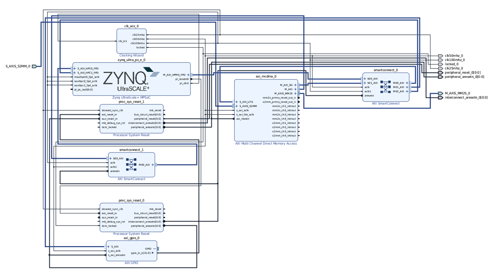

.. highlight:: console

===============
Hardware Design
===============

The hardware design includes a static region and a dynamic region.
The static region includes common logic shared for different designs such as DMA and reset logic.
The static region is not re-programmed when loading partial bitstreams.
The dynamic region includes different designs and various IP instantiations that are specific for a certain design.
The dynamic region is re-programmed when loading partial bitstreams.
Note that when loading a full bitstream will re-program the whole FPGA.

Individual steps for genearting bitstreams
------------------------------------------

The scripts go through the following steps to generate the bitstreams.

#. Design checkpoints are generated for various components.

   * IPs: the scripts for generating IPs can be found in ``hardware/ip``.

   * Block design: we use block designs to specify the static region where the scripts can be found under ``hardware/bd``

   * Reconfigurable modules: reconfigurable modules are SystemVerilog wrappers that instantiates IP blocks and SystemC modules in reconfigurable partitions. 
     SystemC modules are generated by ``systemc-clang`` from C++.
     The modules are located in ``hardware/rtl``.

#. The top design combines various components to form a synthesized top design checkpoints.

#. The synthesized design checkpoints are then pushed through implmentation steps producing routed design checkpoints.

#. The dynamic region in the routed design checkpoints are replaced with other possible modules for partial reconfiguration.
   Routed design checkpoints are produced for each possible partial reconfiguration.

#. The full bitstreams as well as partial bitstreams are generated from the routed design checkpoints.

Static region and block design
------------------------------

We implement the static region with a block deisng located in ``hardware/bd/bd_ultra96v2.tcl``.
The static region includes reset logic, multi-channel DMA engine and AXI interconnects.
The following image shows the components in the static region.

When generating the bitstream, a design checkpoint will be generated for the block design under ``hardware/bd``, which will be used to compose the top design.

Partial reconfiguration
-----------------------

A reconfigurable partition is specified in ``hardware/rtl/top_mcdma.sv`` as the ``reconf_part_0`` module, in which its logic can be dynamically swapped without changing the static region.
The module is a black-box and defines the ports to the static region.

.. code-block:: systemverilog

  module reconf_part_0(
    // ...
  );
    // ...
  endmodule

SystemC designs are wrapped in wrapper modules with necessary IPs.
For example, the wrapper for ``zhw_encode`` can be found at ``hardware/rtl/z3wrapper.sv`` and we show the high level structure of the file as follows.
Note that the wrapper is named ``reconf_part_0``.
When generating the bitstream, the wrapper will be synthesized to design checkpoints under ``hardware/rtl/RM_reconf_z3`` folder.

.. code-block:: systemverilog

  module reconf_part_0(
    // port declaration
  );
    // signal declaration
    axis_dwidth_32_64 in_traffic_32_64 (
      // port connection
    );
    axis_dwidth_64_32 out_traffic_64_32 (
      // port connection
    );
    mymodule_sc_module_0 dut ();
  endmodule

The top design at ``hardware/rtl/top_mcdma.sv`` combines both the static region and the dynamic region.

.. code-block::systemverilog

  module top(
    // ports
  );
    bd_wrapper sw(
      // port connection
    );

    reconf_part_0 inst_rp(
      .*
    );

  endmodule

